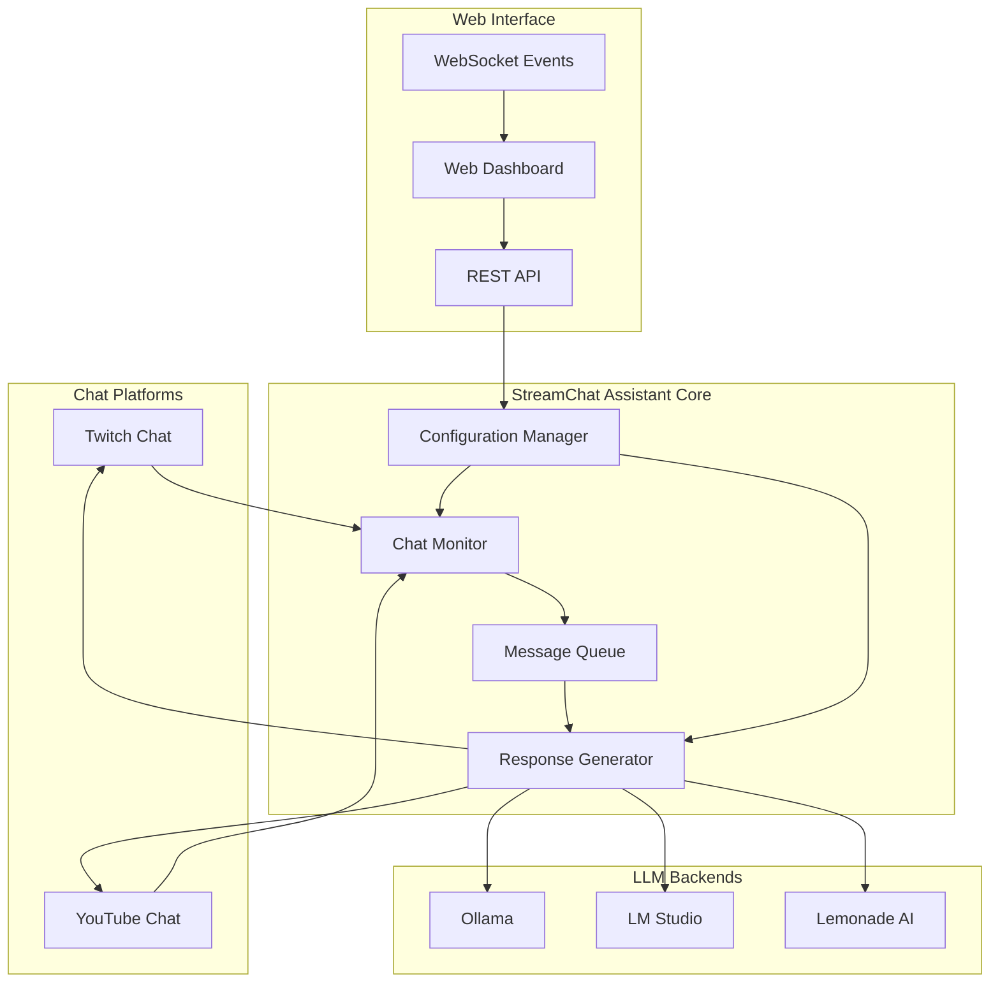

# Design Document

## Overview

The LLM StreamChat Assistant is designed as a modular, async-first Python application that enhances existing streaming infrastructure with AI-powered chat interactions. The system builds upon the current project structure while adding sophisticated LLM integration, configuration management, and real-time web dashboard capabilities.

The architecture prioritizes low latency, reliability, and extensibility to support live streaming environments where responsiveness is critical. The design leverages existing dependencies (twitchio, pytchat, Flask, Flask-SocketIO) while adding intelligent response generation through local LLM backends.

## Architecture

### High-Level Architecture



### Component Interaction Flow

1. **Chat Monitoring**: Chat Monitor establishes connections to enabled platforms and continuously monitors for messages
2. **Message Processing**: Incoming messages are queued and processed asynchronously through the Message Queue
3. **LLM Integration**: Response Generator sends context to the configured LLM backend and processes responses
4. **Response Delivery**: Generated responses are formatted and sent back to the originating chat platform
5. **Web Management**: Dashboard provides real-time control, monitoring, and configuration updates

## Components and Interfaces

### Chat Monitor (`chat_monitor.py`)

**Responsibilities:**
- Manage connections to Twitch and YouTube chat platforms
- Monitor incoming messages from enabled platforms
- Handle connection failures and reconnection logic
- Route messages to the processing queue

**Key Classes:**
```python
class ChatMonitor:
    async def start_monitoring()
    async def stop_monitoring()
    async def connect_twitch()
    async def connect_youtube()
    async def handle_message(platform: str, message: ChatMessage)
    async def reconnect_with_backoff(platform: str)

class ChatMessage:
    platform: str
    username: str
    content: str
    timestamp: datetime
    channel: str
```

**Interfaces:**
- Async message handling with platform identification
- Event-driven architecture for real-time processing
- Configurable platform enable/disable functionality

### Response Generator (`response_generator.py`)

**Responsibilities:**
- Process queued chat messages
- Generate context-aware prompts for LLM backends
- Handle LLM communication and response processing
- Apply personality and configuration settings
- Manage response frequency and rate limiting

**Key Classes:**
```python
class ResponseGenerator:
    async def process_message(message: ChatMessage)
    async def generate_response(context: str, personality: dict)
    async def send_to_llm(prompt: str) -> str
    def format_response(raw_response: str) -> str
    def should_respond(message: ChatMessage) -> bool

class LLMBackend:
    async def send_request(prompt: str, config: dict) -> str
    async def health_check() -> bool
```

### Configuration Manager (`config_manager.py`)

**Responsibilities:**
- Load and validate configuration from config.yml
- Provide runtime configuration updates
- Manage personality presets and system prompts
- Handle LLM backend selection and settings

**Key Classes:**
```python
class ConfigurationManager:
    def load_config() -> dict
    def validate_config(config: dict) -> bool
    def update_config(updates: dict)
    def get_personality_config() -> dict
    def get_llm_config() -> dict
    def get_platform_config() -> dict
```

### Web Dashboard (`web_dashboard.py`)

**Responsibilities:**
- Provide Flask-based web interface
- Handle real-time updates via Socket.IO
- Manage bot start/stop controls
- Display live logs and system status
- Enable configuration editing

**Key Classes:**
```python
class WebDashboard:
    def start_server()
    def handle_bot_control(action: str, platform: str)
    def handle_config_update(config_data: dict)
    def emit_log_update(log_entry: dict)
    def handle_prompt_test(prompt: str) -> str
```

### LLM Client (`llm_client.py`)

**Responsibilities:**
- Abstract LLM backend communication
- Handle different API protocols (Ollama, LM Studio, Lemonade AI)
- Manage connection pooling and error handling
- Provide unified interface for all backends

**Key Classes:**
```python
class LLMClient:
    async def send_request(backend: str, prompt: str, config: dict) -> str
    async def test_connection(backend: str) -> bool

class OllamaClient(LLMClient):
    async def generate(prompt: str, model: str) -> str

class LMStudioClient(LLMClient):
    async def chat_completion(messages: list, model: str) -> str

class LemonadeAIClient(LLMClient):
    async def generate_response(prompt: str, config: dict) -> str
```

## Data Models

### Configuration Schema

```yaml
# config.yml structure
platforms:
  twitch:
    enabled: boolean
    token: string
    nick: string
    channel: string
  youtube:
    enabled: boolean
    video_id: string

llm:
  backend: string  # "ollama", "lmstudio", "lemonade"
  model: string
  base_url: string
  timeout: integer
  
personality:
  preset: string  # "friendly", "professional", "humorous", "supportive"
  custom_instructions: string
  response_types:
    - conversational
    - informational
    - humorous
    - supportive
  response_length: string  # "short", "medium", "long"
  
behavior:
  response_frequency: float  # 0.0 to 1.0
  min_response_interval: integer  # seconds
  max_queue_size: integer
  
dashboard:
  host: string
  port: integer
  debug: boolean
```

### Message Queue Schema

```python
@dataclass
class QueuedMessage:
    id: str
    platform: str
    username: str
    content: str
    timestamp: datetime
    channel: str
    priority: int
    processed: bool
```

### Response Context Schema

```python
@dataclass
class ResponseContext:
    message: ChatMessage
    personality: dict
    recent_messages: List[ChatMessage]
    user_history: dict
    response_config: dict
```

## Error Handling

### Connection Management
- **Platform Disconnections**: Exponential backoff reconnection with maximum retry limits
- **LLM Backend Failures**: Graceful degradation with error logging, continue chat monitoring
- **Configuration Errors**: Validation on startup with clear error messages and safe defaults

### Message Processing
- **Queue Overflow**: Drop oldest messages when queue exceeds configured limits
- **LLM Timeouts**: Cancel requests after configured timeout, log failure
- **Response Formatting**: Sanitize LLM outputs to prevent chat platform violations

### Web Dashboard
- **Socket.IO Disconnections**: Automatic reconnection with state synchronization
- **Configuration Updates**: Atomic updates with rollback on validation failure
- **Real-time Logging**: Buffer management to prevent memory overflow

## Testing Strategy

### Unit Testing
- **Configuration Manager**: Validate config loading, validation, and updates
- **LLM Clients**: Mock backend responses and test error handling
- **Message Processing**: Test queue management and response generation logic
- **Chat Platform Integration**: Mock platform APIs for connection testing

### Integration Testing
- **End-to-End Message Flow**: Test complete message processing pipeline
- **LLM Backend Integration**: Test actual connections to local LLM services
- **Web Dashboard Functionality**: Test real-time updates and configuration changes
- **Multi-Platform Scenarios**: Test simultaneous Twitch and YouTube operations

### Performance Testing
- **Response Latency**: Measure end-to-end response times under load
- **Concurrent Message Handling**: Test queue performance with multiple simultaneous messages
- **Memory Usage**: Monitor memory consumption during extended operation
- **Connection Stability**: Test long-running connections and reconnection scenarios

### Manual Testing
- **Live Chat Integration**: Test with actual Twitch and YouTube streams
- **LLM Response Quality**: Evaluate response appropriateness and personality consistency
- **Dashboard Usability**: Test web interface functionality and real-time updates
- **Configuration Flexibility**: Test various personality and behavior configurations